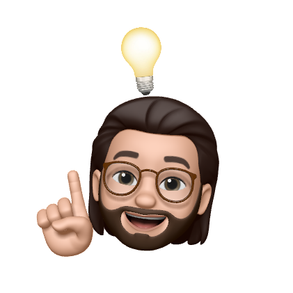
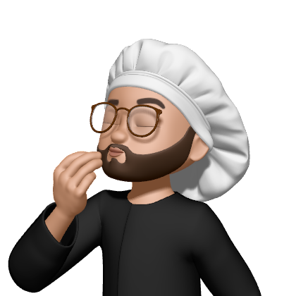

&nbsp;
&nbsp;

&nbsp;

## Hello there, I'm $\large\textcolor{orange}{\textbf{\textsf{Marco Calenda}}}$

25 y.o. MSc student in Computer Science at [@Unisa](https://www.unisa.it), I'm interested in all the **Computer Science** aspects yet I'm in love with:
- **🧠 Machine Learning**
- **🗣 Natural Language Processing**
- **🛠 Software Engineering**
- **🚀 Quantum Computing**

I’m currently learning:
- **Blockchain & Smart Contracts**
- **Quantum NLP**
- **Software Engineering for Artificial Intelligence**
- **Penetration Testing and Ethical Hacking**

## Languages and Tools
&nbsp;
&nbsp;
&nbsp;
&nbsp;
&nbsp;
&nbsp;
&nbsp;

&nbsp;
&nbsp;
&nbsp;
&nbsp;
&nbsp;

&nbsp;
&nbsp;
&nbsp;
&nbsp;

&nbsp;
&nbsp;
&nbsp;
&nbsp;

|||
|-|-|

## Contacts

&nbsp;
&nbsp;

&nbsp;

&nbsp;

 

## When I'm not programming...

...despite being the $\large\textcolor{green}{\textsf{Italian }}\textcolor{lightgray}{\textsf{stereo}}\textcolor{red}{\textsf{type}}$, I love to cook especially first dishes (pasta alla carbonara, lasagne, etc.) and meat of all kinds. I'm not good at pastry yet I love *cheesecakes*, *Sachertorte* and ice cream.

> 🔸 $\large\textcolor{orange}{\textbf{\textsf{Fun Fact}}}$   *When I cook I like to do things well and thoroughly, no matter how much time it takes, just as when I'm programming!*

My other interests are related to:
- 🕹️ Videogames
- ⚽️ Football, *not off the pitch*
- 🪐 Astronomy and space travel
- 📸 Photography, check my Instagram!
- 🍿 TV series and movies, especially *Psychological thriller* and time-related, some of my favorite ones are Shutter Island, Inception, Dark, Sherlock, Death Note.
