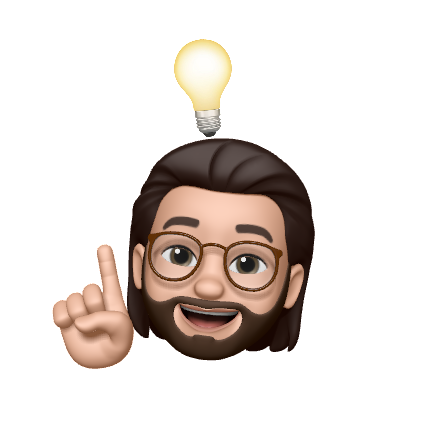

# Hey there, I'm Marco Calenda 👋

### Software Engineer · AI builder · Shipping LLM-powered products from prototype to production

&nbsp;
&nbsp;
&nbsp;

---

## 🧑‍💻 About me

Software engineer with an **MSc in Computer Science** from [University of Salerno (@Unisa)](https://www.unisa.it). I care about the whole stack, from data to deployment, but these are the things that keep me up at night:

- 🤖 **AI Engineering & Agentic Systems**: LLM apps, AI agents, tool calling, MCP, RAG pipelines and evals
- 🧠 **Machine Learning**: from classic ML to fine-tuning and shipping models to production (MLOps)
- 🗣️ **Natural Language Processing**: the field that turned into the LLM era
- 🛠️ **Software Engineering**: clean architecture, CI/CD, DevEx and AI-assisted development workflows
- 🚀 **Quantum Computing**: still science fiction, but I'm keeping an eye on it

> [!TIP]
> Got a cool project, an idea for a side project, or just want to talk about AI and software? My DMs on [LinkedIn](https://www.linkedin.com/in/mcalenda/) are always open.

## 🧰 Tech Stack

| Area | Stack |
|-|-|
| **Languages** |         |
| **AI / ML** |     |
| **Frontend** |         |
| **Backend & Data** |      |
| **DevOps & Tools** |      |
| **OS** |     |

## 📊 GitHub Stats

## 📬 Let's connect

&nbsp;
&nbsp;
&nbsp;
&nbsp;

<!--
&nbsp;

-->

## 🍝 When I'm not pushing to prod...

Yes, I'm the Italian stereotype: I love to cook, especially *primi piatti* (carbonara, lasagne, you name it) and meat of every kind. Pastry isn't my strong suit, but I'll never say no to a *cheesecake*, a *Sachertorte* or some good *gelato*.

> [!NOTE]
> *When I cook I like to do things properly and thoroughly, no matter how long it takes. Same as when I write code (no blind vibe coding allowed in my kitchen).*

<b>🎲 More things I'm into</b>

 

- 🕹️ **Videogames**
- ⚽️ **Football**, *strictly on the pitch*
- 🪐 **Astronomy** and space exploration
- 📸 **Photography**: check out my [Instagram](https://www.instagram.com/marco.calenda/)!
- 🍿 **TV series and movies**, especially psychological thrillers and anything that messes with time: *Shutter Island*, *Inception*, *Dark*, *Sherlock*, *Death Note*

